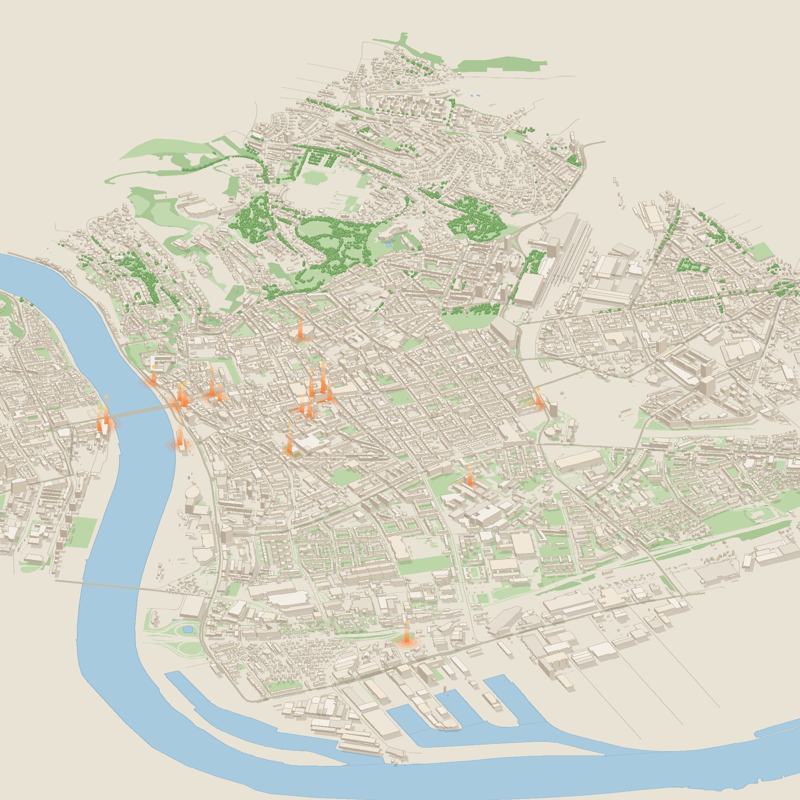
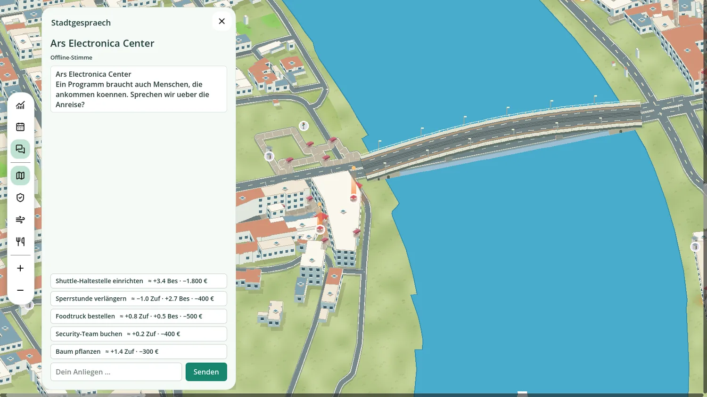

# Stadttopia

**Three days. One city. Many voices.** — a mayor game built on Linz's real open data,
created at the AI Hackathon of Ars Electronica Festival 2026 (*Negotiating Humanity*),
Grand Garage, Tabakfabrik Linz.

You are mayor of Linz during festival weekend. The city speaks — trees, fountains,
streets, venues — and every decision you negotiate moves three meters: **Besucher:innen,
Geld, Zufriedenheit**. Your legacy is a **Gesamtnote from 0 to 100**.



## What makes it different

- **A baked isometric miniature of the real city** — 11,000+ buildings extruded from
  OpenStreetMap `height` tags, the Danube with real bridges, tree sprites, venue beacons
- **The city negotiates** — every entity is a Mistral-powered persona grounded in its
  actual dataset record (a 100-year-old linden, a street with a naming history); a local
  proxy pools keys, caches responses, and degrades to canned voices fully offline
- **Decisions declare their stakes** — every option previews its effect before you commit
  (≈ +2 Zufriedenheit · −800 €)
- **Real systems, not vibes** — a security risk model with deterministic incidents where
  crowds outgrow guards; daily *Bürgeranliegen* (citizen wishes) with rewards; air quality
  from a live Linz station; shade from the actual tree register
- **HOI4-style map modes** — Sicherheit (risk heat), Luft (PM10 + canopy), Versorgung
  (walk-radius coverage), with live values under the cursor
- **Bulk actions** — Ctrl+click twenty trees, apply one decision to all of them



## How it works (technical basis)

```
data/ (festival export + City of Linz CSVs, CC BY 4.0)
  └─ tools/extract_innenstadt.py   → typed JSONs (venues, trees, services, streets, air)
  └─ tools/render_map.py           → 8192² iso PNG + map_meta.json (projection contract)

game/godot/ (Godot 4.7, GDScript, no engine plugins)
  ├─ data_loader.gd   autoload; everything is data-driven — swap datasets + bounds
  │                   and the same build plays another city
  ├─ game_state.gd    pure logic: meters, decisions, risk model, petitions — unit-tested
  ├─ map_view.gd      baked map + runtime projection (markers, layers, multi-select)
  ├─ dialogue.gd      personas via the local proxy; fallback voices offline
  └─ tests/           7 headless suites (~250 checks): run godot -s res://tests/…
```

The map is a *photograph*; the game is a transparent sheet on top of it — that's how a
3-person team renders a whole city at 60 fps on integrated graphics.

## Run it

Requires **Godot 4.7.2**. From the repository root:

```bash
godot --headless --path game/godot --import   # REQUIRED after pulls: re-imports assets
godot --path game/godot                        # play
```

For live dialogue voices, start the key proxy in a second terminal
(see [mistral-proxy/README.md](mistral-proxy/README.md)):

```bash
python3 mistral-proxy/server.py
```

Everything except free-form chat works offline (cache → pre-generated personas).
**Just want to play?** Prebuilt binaries for Linux and Windows are on the
[Releases page](https://github.com/LPuehringerStudent/KI-Hackathon-2026/releases/latest) —
download, run, no build needed. Rebuild anytime with `bash tools/build_game.sh`.

## Tests

```bash
godot --headless --path game/godot -s res://tests/run_tests.gd             # logic
godot --headless --path game/godot -s res://tests/run_data_tests.gd        # data + map
godot --headless --path game/godot -s res://tests/run_integration_tests.gd # full game
python3 tools/check_proxy_client.py godot                                  # proxy client
```

## Data sources & attribution

- **Festival program dataset** — Ars Electronica 2026 (provided for the hackathon)
- **City of Linz open data** — Baumkataster, WC-Anlagen, Trinkbrunnen, Straßennamen (CC BY 4.0)
- **OpenStreetMap** contributors (ODbL) — buildings, water, roads, trees for the bake
- **Air quality** — Land Oberösterreich Umweltschutz (CC BY 4.0), station S184 Stadtpark

## Team

| Who | GitHub | Track |
|-----|--------|-------|
| Laurenz | [LPuehringerStudent](https://github.com/LPuehringerStudent) | Map, data pipeline, integration |
| Ayan | [ayan2310](https://github.com/ayan2310) | 3D models, art, UI |
| David | [David-Fruehwirth](https://github.com/David-Fruehwirth) | Game logic, balance |

Built with three AI agents (Kimi, Claude, GPT) pair-programming each track —
see `docs/archive/` for the full coordination log.

## License

[MIT](LICENSE) · game data under the licenses listed above.
